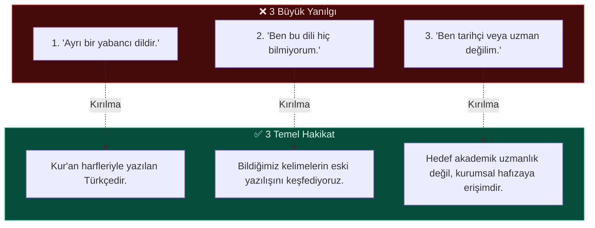
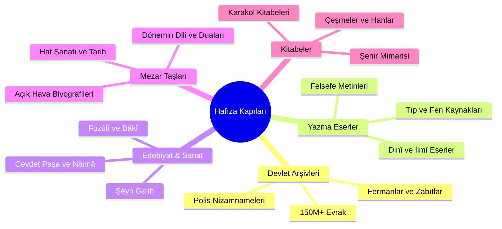

# 🏛️ İNFOGRAFİK: OSMANLI TÜRKÇESİ NİÇİN ÖĞRENMELİYİZ?
### 👮‍♂️ Polis Memurlarına Yönelik Seminer Görsel Özeti

---

> 🔑 **Ana Mesaj:** *"Osmanlı Türkçesi, geçmişe dönmek değil; geçmişimizin yazılı hafızasına ulaşabilmektir."*

---

## 📊 1. Rakamlarla Osmanlı Yazılı Mirası

| Metrik | Değer | Anlamı / Kapsamı |
| :--- | :---: | :--- |
| **Cumhurbaşkanlığı Arşivi** | **150 Milyon+** | Resmî belge, nizamname, irade ve ferman |
| **Redhouse Sözlüğü (1890)** | **150.000** | Zengin kelime hazinesi (90.000 madde başı) |
| **Temel Okutucu Harf** | **4 Harf** | Okuma mantığını 5 dakikada kavratan temel anahtar |
| **Polis Tarihî Hafızası** | **1 Asır+** | Zabıta nizamnameleri, asayiş emirleri, sicil defterleri |

---

## 🧭 2. Seminerin Pedagojik Akış Haritası


---

## 💡 3. Zihinsel Bariyerler vs. Gerçekler



---

## 🏰 4. Kültür ve Medeniyet Hafızasının 5 Sütunu



---

## ✍️ 5. Pratik Okuma: 4 Temel Okutucu Harf

```
┌────────────────────────────────────────────────────────────────────────┐
│                      4 TEMEL OKUTUCU HARF REHBERİ                      │
├─────────┬──────────────┬──────────────────┬────────────────────────────┤
│  HARF   │     ADI      │   SES KARŞILIĞI  │        ÖRNEK ÇÖZÜM         │
├─────────┼──────────────┼──────────────────┼────────────────────────────┤
│    ا    │  Elif        │  A               │  بابا  = B + A + B + A     │
│         │              │                  │  ➔ BABA                    │
├─────────┼──────────────┼──────────────────┼────────────────────────────┤
│    ه    │  He          │  E               │  دده   = D + E + D + E     │
│         │              │                  │  ➔ DEDE                    │
├─────────┼──────────────┼──────────────────┼────────────────────────────┤
│    و    │  Vav         │  O / U / Ö / Ü   │  چوجوق = Ç + O + C + U + K │
│         │              │                  │  ➔ ÇOCUK                   │
├─────────┼──────────────┼──────────────────┼────────────────────────────┤
│    ی    │  Ye          │  I / İ           │  كیوی  = K + İ + V + İ     │
│         │              │                  │  ➔ KİVİ                    │
└─────────┴──────────────┴──────────────────┴────────────────────────────┘
```

---

## 🎯 6. Polis Memurlarına Özel Mesaj

> [!IMPORTANT]
> **"Türk polisinin bir tarihi varsa, bu tarihin belgelerini okuyabilecek bir neslin de olması gerekir."**
> 
> * Osmanlı dönemi zabıta nizamnameleri
> * Asayiş ve karakol yazışmaları
> * Sicil ve teşkilat hafızası
> 
> Osmanlı Türkçesi öğrenmek; geçmişe dönmek değil, **kurumsal kimliğin köklerine bizzat birinci elden ulaşmaktır.**

---

## 🧠 7. Katılımcının Psikolojik Dönüşüm Merdiveni

1. 🛑 **Başlangıç:** *"Osmanlıca çok zor, ben okuyamam."*
2. 🔍 **Uygulama (10. dk):** *"Harfleri birleştirince 'BABA', 'DEDE', 'ÇOCUK' okuyabildim!"*
3. 📈 **Seminer Sonu:** *"Biraz pratik yaparsam mesleki belgeleri çözebilirim."*
4. 🚀 **Kurs Daveti:** *"Ben bu hafızaya sahip çıkmak ve öğrenmek istiyorum!"*

---

> 🌟 **Kapanış Mottosu:**
> *"Asırların birikimi olan kültür ve medeniyet mirasımıza ulaşmak, maziden atiye köprü kurmak için Osmanlı Türkçesi öğreniyoruz."*
